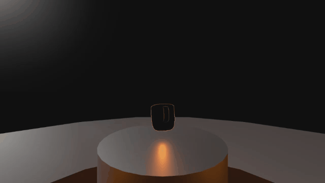

# Elite Dangerous Hologram VFX in the Godot Engine

A recreation of some of the hologram VFX used in the game Elite Dangerous.

## Running the Demo

Run `Main.tscn` from the editor and press "1" or "4" to switch to the side panels and back (just like in Elite).

## License

This repository is available under the [MIT license](LICENSE.md).

The [Exo 2](https://fonts.google.com/specimen/Exo+2) font by Nataneal Gama is used in this project.
